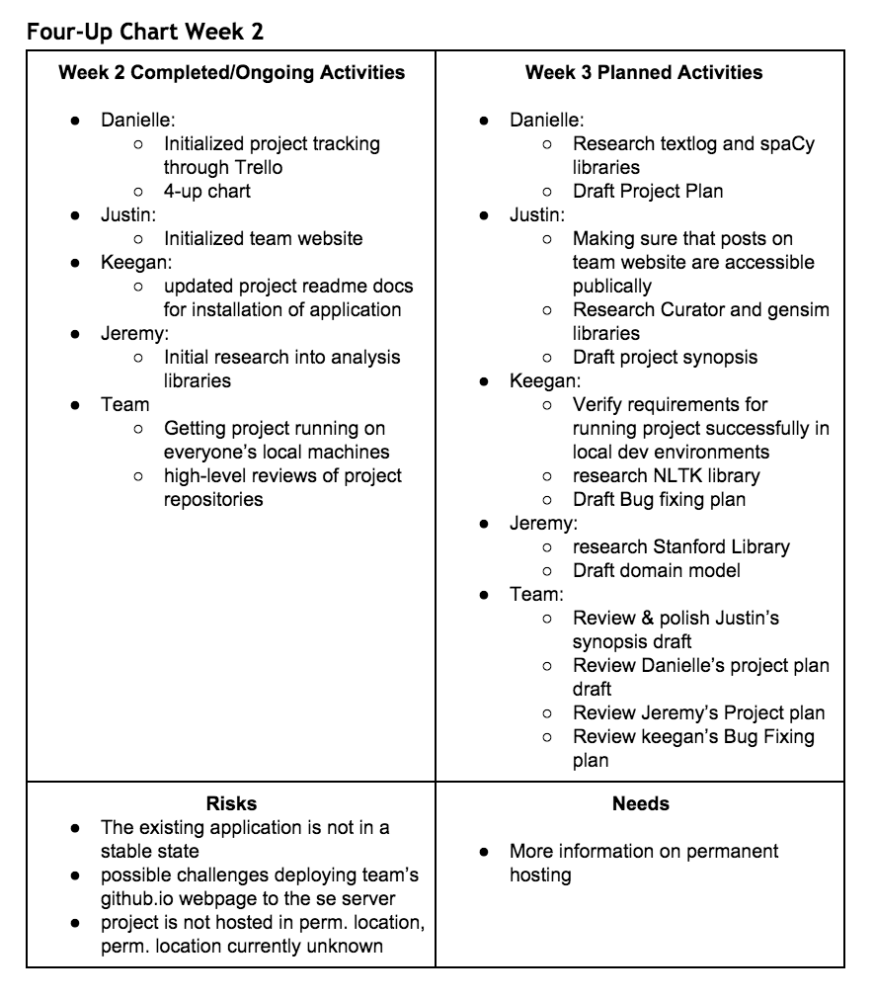

# Week 2

### Project Update
Progress on the project is going quite well so far! Now that the team is in the habit of meeting regularly we have all been able to
partition out the work and take some tasks to report back on each week. The next couple weeks are going to be mainly procefural work,
with a focus on project stability and taking care of the issues that have been documented by the previous year's team. 

Once this work is complete, we would like to get started on user testing as early as possible. As stated by the project
sponsor, the application is in a state where it would not be usable for an in class activity, so we would like to 
clearly identify the use cases that could be implemented in order to get the application up to that point. The
previous year's team did a fantastic job getting the app hosted in a stable state, so we should be in
good shape moving forward. Here's to a great year and hopefully a project that will have a major impact on
language science education here at RIT!

### 4-Up Chart

### Time Updates
[Full chart can be found here]({{site.baseurl}}../../../staticcontent/week2-timesheet.pdf)

* Keegan: 7
* Danielle: 4.1
* Jeremy: 5.1
* Justin: 6.1

Total Hrs. Spent: 22.3
