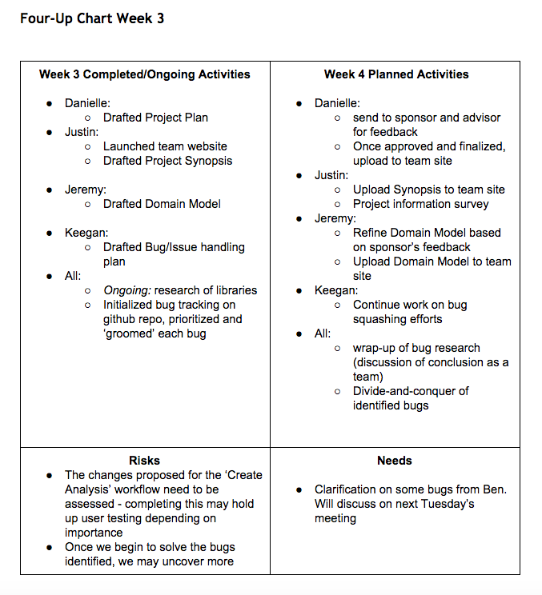

# Week3 

### Project Update
The site has now been published live on the SE domain! The team has spent a good deal of time over the 
last week taking care of the documentation and process needed in order to get our project up and
running. We have also solidified some technical requirements with our sponsor and are meeting with
two external stakeholders to fix some already existing bugs and to develop a deployment plan. 

The team has decided to go with a pure SCRUM based agile methodology, and we have selected a few
tools in order to help out with the effort. We will be planning all development tasks through github issues
and have found a nifty plugin called waffle.io to track SCRUM related metrics right from our already existing
issues! We plan to use this in combination with Trello and our timetables that are already being recorded each week
to plan out some useful metrics to allow us to be more transparent towards external stakeholders. 

We have also formalized our project plan and domain model documents for review by our sponsor and coach
1 week prior to formal submission. We have been fortunate enough to keep ahead on documentation over the
last few weeks (shout out to Danielle and Jeremy!) so we are able to go full steam ahead on our first milestone!

The team hopes to have initial bugs fixed and the application in a usable state within a time period of four weeks
so that we can begin initial user testing. From that point forward, we would like to conduct a new batch of user
testing with the help of Cici every five weeks. This lines up with when we would like to release epics for the application.

##This Week's Documents:

* [Project Plan Document](https://docs.google.com/a/g.rit.edu/document/d/1Bn1CqBUIt7OIr91M3_wkn9uJoujOMbz_tpm1bdiqcbE/edit?usp=sharing)
* [Initial Domain Model](https://drive.google.com/a/g.rit.edu/file/d/0BwSpC6rxFMqhaU1CcUlRbkRJeEk/view?usp=sharing)

### 4-Up Chart

### Time Updates
[Full chart can be found here]({{site.baseurl}}../../../staticcontent/week3-timesheet.pdf)

* Keegan: 3.9 
* Danielle: 6.4 
* Jeremy: 5
* Justin: 6.5 

Total Hrs. Spent: 21.8 
