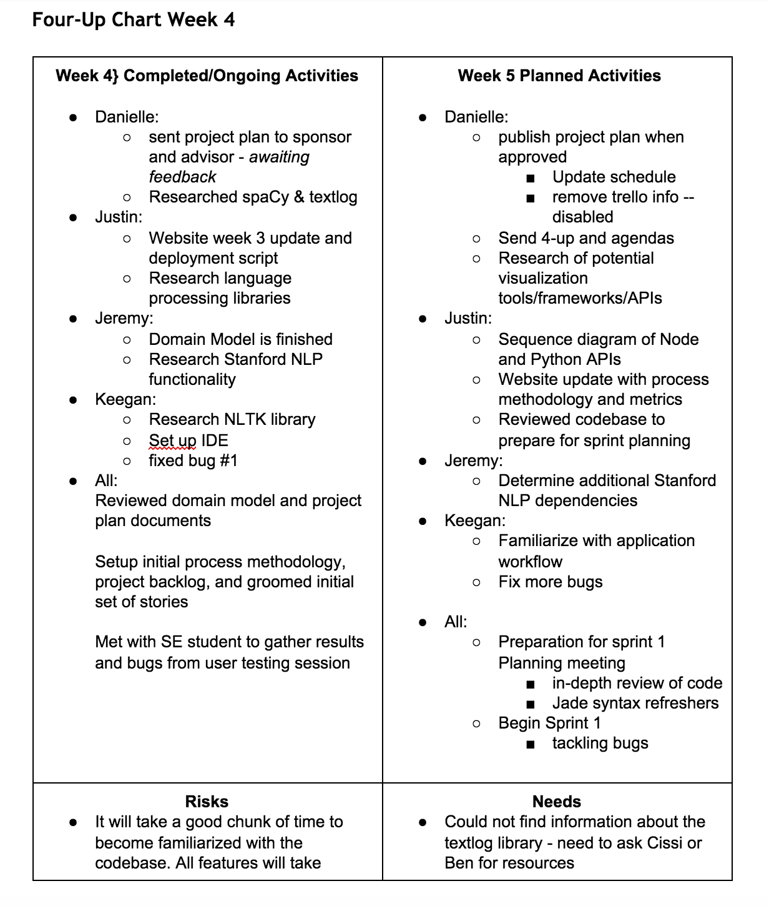

# Week4

### Project Update
Sprint zero will officially be ending as of Tuesday, September 22nd! We have an official sprint backlog as well as
defined metrics that we will be using to track the progress of the team over the course of this academic year.

The team has chosen to move along with the SCRUM development methodology for the duration of the project, as we
believe that there are several principles of SCRUM that will allow the team to perform at its best. Below is the official
statement from our team coordinater, located in the project pln posted last week. 

> "We have chosen the Scrum methodology as a guideline for our project management. Work will be completed in two week iterations, or ‘sprints’. User stories will be assigned to each team member from the product backlog (collective list of all features and tasks to complete for the project) at a planning meeting (with sponsor) before each iteration. The team will use the Slack messaging platform to maintain a high level of availability. This platform also provides integration with both Github and the Trello management application. To track individual progress as well as provide a ‘big picture’ view of work being done, the team has created a Trello board. On this board we are tracking which deliverables are due weekly, as well as assigning work on a week-by-week basis based on our schedule. Individual team members can identify which items they are working on and attach color-coded labels to the user story or work item to indicate its status. As the project progresses, issues and bugs will be tracked using the issues feature built into the existing Github repository for Linguine."

### Development Metrics

The primary methods of collecting metrics for the application will be done through extensive user testing with outside parties and
through performance testing the application as it stands, as well as once new features are added. Official metrics are listed as follows: 

* time spent completing an analysis from start to finish 
* number of clicks to complete an analysis 
* number of questions asked by testing participants
* user satisfaction survey results
* Ratio of bugs fixed vs bugs discovered per iteration
* number of completed user stories per iteration versus number assigned
* story points per sprint
* individual velocity of team members (Story points completed on average in a given two week sprint)
* Throughput of Github issues closed by individual over time

The team believes that these metrics will give us a good overview of project status at each iteration.

### 4-Up Chart

### Time Updates
[Full chart can be found here]({{site.baseurl}}../../../staticcontent/week4-timesheet.pdf)

* Keegan: 
* Danielle: 
* Jeremy: 
* Justin:  

Total Hrs. Spent: 
